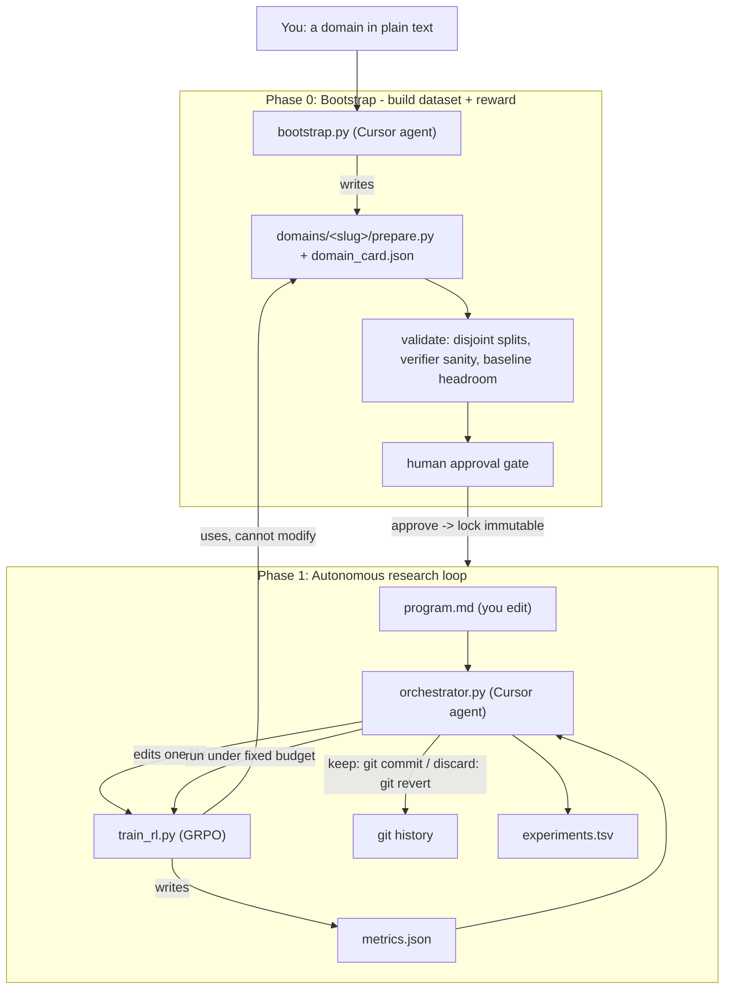

# Auto-RL

**An autonomous research pipeline for RLVR post-training, driven end-to-end by Cursor agents.**

You name a domain in plain text — *"be an expert at unit conversions"* — and Auto-RL does the rest of the research loop by itself:

1. **Builds the dataset + reward.** A Cursor agent writes a programmatic problem generator (or sources a dataset) and a deterministic, verifiable reward function for that domain.
2. **Writes the training code.** It implements/edits a from-scratch GRPO trainer.
3. **Tunes the hyperparameters and rewrites the algorithm.** Each iteration it forms a hypothesis (learning rate, group size, reward shaping, KL, sampling temperature, ...) and edits the trainer accordingly.
4. **Runs the recursive train → evaluate → keep/discard loop.** It trains under a fixed budget, scores held-out verified accuracy, commits improvements and reverts regressions, and repeats.

This is the RL analogue of [karpathy/autoresearch](https://github.com/karpathy/autoresearch). Where autoresearch optimizes `val_bpb` on nanochat pretraining, Auto-RL optimizes **held-out verified accuracy** on a domain *you invent in a sentence* — and, crucially, it generates the verifiable reward for that domain automatically, so the entire RLVR research pipeline is automated, not just the hyperparameter search.

---

## What makes it different

Most "auto-ML" loops only tune knobs on a fixed task. Auto-RL automates the **whole** RLVR pipeline:

| Stage | Normally done by a human researcher | In Auto-RL |
| --- | --- | --- |
| Define the task + dataset | hand-pick/curate a dataset | **agent builds a generator/dataset from a plain-text domain** |
| Define the verifiable reward | hand-write a verifier | **agent writes a programmatic verifier (validated + locked)** |
| Write the RL training code | implement GRPO/PPO | **agent writes & rewrites `train_rl.py`** |
| Tune hyperparameters | manual sweeps | **agent proposes one change per iteration** |
| Run experiments + decide | babysit runs, compare, keep/revert | **orchestrator runs, evaluates, commits or reverts via git** |

---

## Powered by the Cursor Agent SDK

The autonomous behavior is driven by the [Cursor Python SDK](https://cursor.com/docs/sdk/python). Cursor agents are the *engine* of this project in two places, and in both they **read and write the repository's own source files**:

**1. Dataset + reward generation (`bootstrap.py`).** A Cursor agent turns your plain-text domain into a working domain pack — it authors `domains/<slug>/prepare.py` and `domain_card.json`, choosing the best ground-truth source and a programmatic verifier. The orchestration code launches and talks to the agent through a thin wrapper:

```97:107:agentlib.py
@contextmanager
def open_agent(cwd, model: str = DEFAULT_MODEL, api_key: Optional[str] = None) -> Iterator["AgentSession"]:
    """Open a persistent local agent rooted at ``cwd`` for multi-turn use."""
    Agent, CursorAgentError, LocalAgentOptions = _import_sdk()
    key = require_api_key(api_key)
    with Agent.create(
        model=model,
        api_key=key,
        local=LocalAgentOptions(cwd=str(cwd)),
    ) as agent:
        yield AgentSession(agent, CursorAgentError)
```

**2. The self-modifying research loop (`orchestrator.py`).** Each iteration spins up a Cursor agent that reads `program.md` + the experiment ledger and **edits `train_rl.py` in place** — changing the model's own training algorithm and hyperparameters. The orchestrator then runs that edited code, scores it, and uses git to keep or revert the agent's edit:

```python
with agentlib.open_agent(REPO_ROOT, model=args.model) as session:
    session.send(propose_prompt(slug, best_acc))   # agent edits train_rl.py
outcome = run_experiment(slug, exp_id)             # run the agent's code
# improved? git commit train_rl.py.  worse? git checkout -- train_rl.py.
```

The SDK integration follows the documented best practices: local runtime with an explicit `api_key`, always `wait()` on the run, `run.id`/`agent_id` logged, and the two failure modes distinguished (`CursorAgentError` = run never started, vs `result.status == "error"` = ran but failed). It also hardens one SDK bridge edge case (auth tokens that begin with `-`).

> The human's job shifts from doing the research to **programming the program**: you edit `program.md` (the agent's standing instructions) and name domains. The agents do the experiments.

---

## See it in action (real runs)

**Built-in GSM8K math, smoke scale on an M-series Mac:**

```
[orchestrator] baseline eval_acc=0.1250
== iteration 1 == agent: "add a format bonus so all-fail GRPO groups still get signal"  -> 0.1250  reverted
== iteration 2 == agent: "raise learning rate 1e-6 -> 5e-6"                              -> 0.0000  reverted
```

**A brand-new domain invented in one sentence — *"be an expert at unit conversions"*:**

```
$ python bootstrap.py "be an expert at unit conversions ..." --slug units
[agent] studies the gsm8k reference, writes a deterministic generator + verifier
[bootstrap] validation passed: train/eval disjoint, verifier accepts gold & rejects wrong
[bootstrap] baseline_acc = 0.750   ->  approved + LOCKED

$ AUTO_RL_DOMAIN=units python orchestrator.py --iterations 3
[orchestrator] baseline eval_acc=0.7500
== iteration 1 == agent: "graded near-miss reward for answers within 5%"      -> 0.7500  reverted
== iteration 2 == agent: "increase GRPO group size 8 -> 16 for less noisy advantages"  -> 0.8750  KEPT ✓
```

That last line is the whole point: the model got **better at a domain that didn't exist a minute earlier**, with the dataset, reward, training code, and the improving change all produced autonomously.

---

## How it works



The orchestrator owns the experiment harness; the Cursor agent is the "mutation function" that edits exactly one file. The reward (verifier + eval set) is locked immutable before training and the agent only ever edits `train_rl.py`, so **the reward cannot be gamed**.

## Files

| File | Role | Who edits it |
| --- | --- | --- |
| `bootstrap.py` | Phase 0: plain-text domain → validated, approved, locked domain pack (**Cursor SDK**). | — |
| `orchestrator.py` | Phase 1: the autonomous research loop (**Cursor SDK**). | — |
| `agentlib.py` | Cursor SDK wrapper: agent lifecycle, streaming, error handling. | — |
| `harness.py` | Fixed infra: scale/device config, model loading, generation, `evaluate()`, the domain-pack contract. | nobody |
| `train_rl.py` | From-scratch GRPO training loop. **The one file the research agent edits.** | the Cursor agent |
| `program.md` | Standing instructions for the research agent. | **you** (the human) |
| `domains/<slug>/prepare.py` | A domain pack: problems + programmatic `verify()`. Generated in Phase 0, then locked. | bootstrap agent (then frozen) |
| `domains/<slug>/domain_card.json` | Domain metadata (source, samples, baseline). | bootstrap agent |
| `experiments.tsv` | Append-only ledger of every experiment. | orchestrator |
| `selftest.py` | Offline self-test (no torch/network/API needed). | — |

Built-in example domains: **`gsm8k`** (math) and **`units`** (auto-generated unit conversions).

## Requirements

- **Python 3.10–3.12** for the full ML stack (PyTorch wheels currently top out around 3.12). The offline self-test runs on any 3.10+.
- A single **NVIDIA GPU** (H100/A100/4090) for real `full`-scale runs; **Apple Silicon (MPS)** works for `smoke`-scale development.
- A **Cursor API key** for the autonomous agent loops (`CURSOR_API_KEY`).

## Setup

```bash
# with uv (recommended)
uv venv && uv pip install -e .

# or plain pip on a 3.10-3.12 interpreter
python -m venv .venv && . .venv/bin/activate
pip install torch transformers datasets accelerate sympy cursor-sdk

# auth: put this in a .env file (auto-loaded) or export it
export CURSOR_API_KEY="cursor_..."   # https://cursor.com/dashboard/integrations
```

Sanity-check the wiring with the offline self-test (no heavy deps required):

```bash
python selftest.py        # 24 checks: verifier, eval, bootstrap validation, git keep/discard
```

## Usage

### 1. Train on a built-in domain

```bash
# single experiment by hand
AUTO_RL_DOMAIN=gsm8k AUTO_RL_SCALE=smoke python train_rl.py

# autonomous loop
AUTO_RL_DOMAIN=gsm8k AUTO_RL_SCALE=smoke python orchestrator.py --iterations 20 --allow-unlocked
```

### 2. Invent a new domain in plain text

```bash
python bootstrap.py "be an expert at converting Roman numerals to integers"
python bootstrap.py "solve single-variable linear equations for x" --slug algebra
python bootstrap.py "be an expert at unit conversions" --slug units
```

Bootstrap will: generate the pack, validate it, measure the base model's baseline (headroom check), show you a summary, and ask for approval before locking it. Then:

```bash
AUTO_RL_DOMAIN=algebra python orchestrator.py --iterations 50
```

No SDK / API key handy? Do it manually:

```bash
python bootstrap.py "your domain" --print-prompt   # paste into a Cursor chat
python bootstrap.py "your domain" --validate-only   # then validate + approve
```

### 3. Steer the research

Edit `program.md` — the agent's standing instructions and list of ideas to try. You program the program; the agent runs the experiments.

## Mac dev vs cloud GPU

Two env vars control everything; the code path is identical, only sizes and the budget change:

| | `AUTO_RL_SCALE=smoke` (Mac dev) | `AUTO_RL_SCALE=full` (cloud GPU) |
| --- | --- | --- |
| eval problems | 8 | 200 |
| max new tokens | 160 | 512 |
| group size / prompts-per-step | 4 / 2 | 8 / 8 |
| per-experiment budget | 120 s | 900 s |

```bash
# on a rented single NVIDIA GPU
export CURSOR_API_KEY="cursor_..."
AUTO_RL_SCALE=full AUTO_RL_DOMAIN=gsm8k python orchestrator.py --iterations 100
```

Device is auto-detected (`cuda` → `mps` → `cpu`). Override the base model with `AUTO_RL_MODEL` (default `Qwen/Qwen2.5-0.5B-Instruct`) and the budget with `AUTO_RL_BUDGET_SEC`.

## Integrity (no reward hacking)

The domain pack (verifier + held-out eval set) is generated in Phase 0 and **locked immutable** (read-only + a `.locked` marker) before any training. The research agent only edits `train_rl.py`; the orchestrator commits/reverts **that file only**, and runs evaluation itself. The verifier is always programmatic — no LLM-as-judge in the reward path — so it stays true RLVR.

## Environment variables

| Var | Default | Meaning |
| --- | --- | --- |
| `AUTO_RL_DOMAIN` | `gsm8k` | active domain slug under `domains/` |
| `AUTO_RL_SCALE` | `smoke` | `smoke` or `full` preset |
| `AUTO_RL_MODEL` | `Qwen/Qwen2.5-0.5B-Instruct` | base model id |
| `AUTO_RL_BUDGET_SEC` | scale preset | per-experiment wall-clock budget |
| `AUTO_RL_METRICS` | `metrics.json` | where `train_rl.py` writes results |
| `AUTO_RL_OFFLINE` | unset | force offline dataset fallback |
| `CURSOR_API_KEY` | — | Cursor SDK auth (required for the agent loops) |

## Caveats

- This is a research scaffold, not a production trainer. The 0.5B default + `smoke` scale (8 eval problems) is chosen so the loop is cheap to iterate on; results are coarse. Use `full` scale on a GPU with more iterations for meaningful gains.
- Bootstrap quality is the main risk: a weak auto-generated dataset or an *unlearnable* verifier (e.g. requiring exact many-decimal answers) caps everything downstream. The validation step, baseline-headroom check, and approval gate are the mitigations — read the domain card before approving.

## License

MIT
